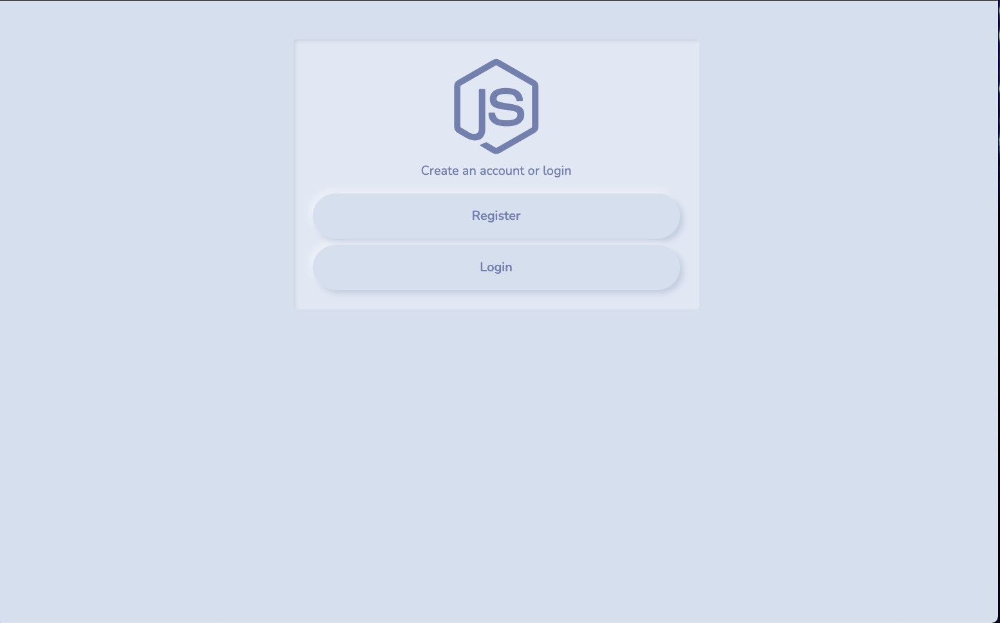
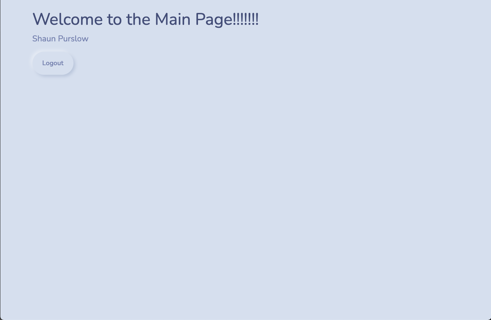

# Login Authentication

User login and registration using Node.js, Express, Passport, Mongoose, EJS and some other packages.

## Usage

```
npm install 
```
```
npm start
```
Visit http://localhost:5000

## MongoDB 

Open "config/keys.js" and add your MongoDB URI, local or Atlas


### ScreenShots

Main Page


Register


Login


Home


logout


